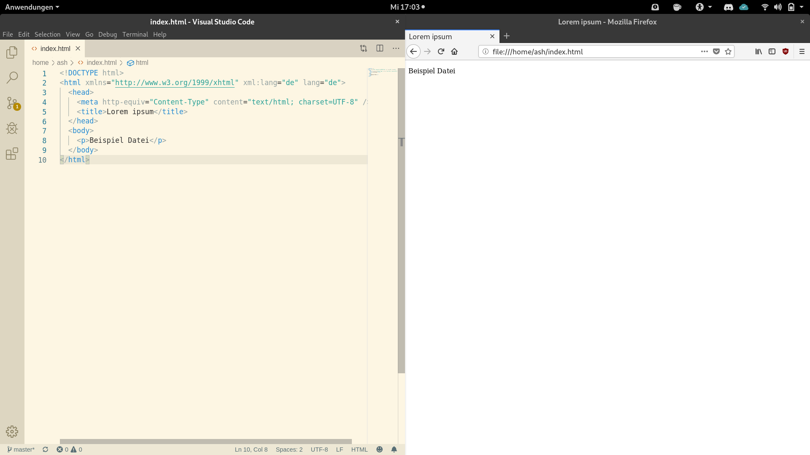

---
tags:
 - study
 - preperation
---
# Programme, Dateien und Code

## Programme

* Zum **Bearbeiten** der HTML- und CSS-Dateien: [Visual Studio Code](https://code.visualstudio.com/).
* Zum **Betrachten**: [Firefox](https://www.mozilla.org/) oder ein anderer Browser.

## Ein Projekt anlegen

1. Lege einen neuen Ordner für das Projekt an (z.B. `mein-projekt`).
2. Öffne Visual Studio Code, wähle *File → New File* und speichere die noch leere Datei als `index.html` in diesem Ordner (*File → Save* oder `Strg + S`).
3. Öffne den Ordner im Datei-Explorer, klicke mit der rechten Maustaste auf `index.html` und wähle *Öffnen mit → Firefox*. Die Datei wird im Browser angezeigt.
4. Schreibe HTML-Code in die Datei (siehe [Einführung HTML](01_HTML.md)), speichere mit `Strg + S` und aktualisiere den Browser mit `F5`. Die Änderungen werden sichtbar.

<iframe width="560" height="315" src="https://www.youtube-nocookie.com/embed/BZNGaMyQDks" title="Erstes HTML-Projekt" allow="accelerometer; autoplay; clipboard-write; encrypted-media; gyroscope; picture-in-picture" allowfullscreen></iframe>

## Eine CSS-Datei ergänzen

5. Lege im Projektordner einen Unterordner `css` an.
6. Erstelle darin eine neue Datei `style.css`. Wie sie in der HTML-Datei eingebunden wird, steht am Anfang von [Einführung CSS](02_CSS.md).

Links die Datei `index.html` in Visual Studio Code, rechts im Browser:



## Dateien und Ordner organisieren

Für **jedes Projekt** ein eigener Ordner, in dem *alle* Dateien des Projekts liegen. Bilder und die CSS-Datei kommen in eigene Unterordner:

```
mein-projekt/
├── index.html
├── css/
│   └── style.css
└── images/
    ├── hintergrund.jpg
    └── tier.jpg
```

> **Merke:** Verwende für **Namen** von Ordnern und Dateien nur Kleinbuchstaben (`a`–`z`), Ziffern und den Bindestrich – keine Umlaute, Leerzeichen oder Sonderzeichen. Das Gleiche gilt für selbst gewählte Namen im Code (Klassen und IDs in CSS). Der sichtbare *Inhalt* der Seite ist davon nicht betroffen.

Dateien verschiebt man im Datei-Explorer wie gewohnt: **ausschneiden** mit `Strg + X`, im Zielordner **einfügen** mit `Strg + V` (oder mit gedrückter Maustaste ziehen). Lädst du z.B. ein Bild aus dem Internet herunter, landet es meist im Ordner *Downloads* – verschiebe es von dort in den `images`-Ordner deines Projekts.

## Relative und absolute Pfade

Verweist eine Datei auf eine andere – ein `<link>` auf die CSS-Datei, ein `` auf ein Bild, ein `<a>` auf eine Unterseite –, muss der **Pfad** zur Zieldatei angegeben werden. Es gibt zwei Arten:

* **Absoluter Pfad** – die vollständige Adresse. Für Dateien im Internet die komplette URL, z.B. `https://www.lmg-remseck.de/`. Funktioniert von überall, zeigt aber immer auf genau diesen einen Ort.
* **Relativer Pfad** – der Weg von der *aktuellen* Datei zur Zieldatei. Verschiebt man den ganzen Projektordner, stimmen relative Pfade weiterhin. Deshalb werden innerhalb eines Projekts (CSS, Bilder, Unterseiten) **relative Pfade** verwendet.

Bausteine für relative Pfade:

| Schreibweise | Bedeutung |
| --- | --- |
| `datei.html` | Datei im selben Ordner |
| `ordner/datei.html` | Datei in einem Unterordner |
| `../datei.html` | eine Ordnerebene nach oben |
| `../../datei.html` | zwei Ordnerebenen nach oben |

Bezogen auf den Projektordner oben:

| Von | Zu | Relativer Pfad |
| --- | --- | --- |
| `index.html` | `style.css` | `css/style.css` |
| `index.html` | `tier.jpg` | `images/tier.jpg` |
| `css/style.css` | `hintergrund.jpg` | `../images/hintergrund.jpg` |

> **Merke:** In HTML beziehen sich `href` und `src` auf den Ort der **HTML-Datei**. In CSS bezieht sich `url(...)` bei `background-image` auf den Ort der **CSS-Datei** – siehe [Layout mit CSS](03_Layout.md).

## Code ordentlich formatieren

Achte auf sauber **eingerückten Code**. [Block-Elemente](01_HTML.md#block--und-inline-elemente) beginnen auf einer neuen Zeile; liegen sie innerhalb eines anderen Elements, werden sie mit dem Tabulator eine Stufe eingerückt.

```html
<ul>
  <li>Erstens</li>
  <li>Zweitens</li>
</ul>
```

> **Merke:** Visual Studio Code richtet den ganzen Code automatisch aus mit *Rechtsklick → Dokument formatieren* (`Umschalt + Alt + F`).
